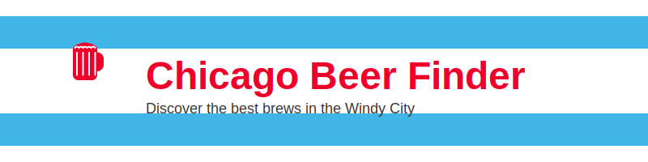

  

  # Chicago Beer Finder

## About

Basic tenants: I have used Claude AI to give me a boost in this overall project and app setup. Claude walked me through how to stand up a basic GitHub CodeSpaces environment, gave me step-by-step instructions and code to include within this repository. I created the backend and frontend files, pasted the code, and voila. Requirement.txt file, Backend Python scraper, backend Python Flask API, frontend React javascript App, frontend React JSON package.

## Features

- Age verification for legal drinking age
- Search functionality for finding beers in Chicago
- Filter options by beer type, ABV range, and brewery
- Responsive design for mobile and desktop use
- Chicago-themed UI with the colors of the Chicago flag

## Technologies Used

- **Frontend**: React, Vite
- **Backend**: Python, Flask
- **Database**: SQLite
- **API**: Custom Flask API for beer data